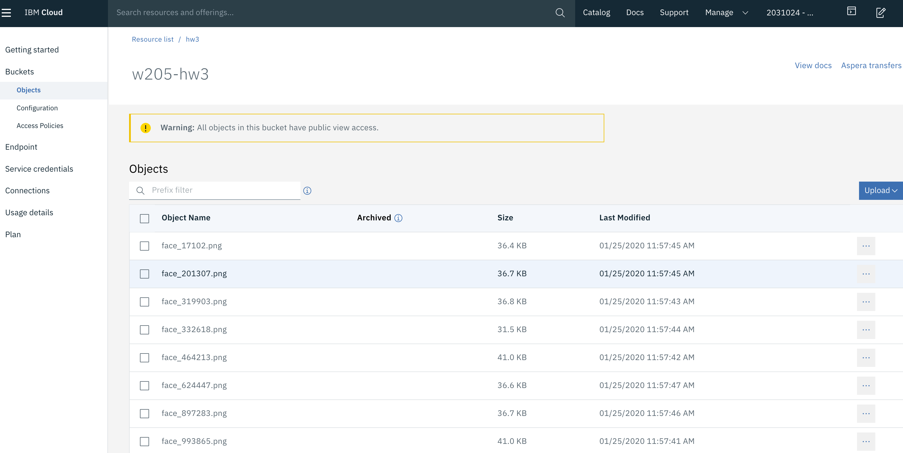

# HW3-Internet of Things 101

## How to set up Jetson TX2

__Build Docker Images for Face Detection and MQTT__

__Build Network Bridge__

## How to Set Up IBM Cloud Server

__Create a new ibm cloud virtual server__

Create a VSI using the gui (using the ssh key imported from HW2)

    Staying in the "Classic" section, navigate to Devices -> Device List
    Select the blue "Order Devices" button at the top right
    Select "Virtual Server" from the list, then "Public Virtual Server"
    Accept the default for Quantity (1) and Billing (Hourly)
    Choose a hostname and domain. You can literally use any domain name you choose, it will not be registered in DNS
    Choose San Jose as a location 
    Select the Compute C1.1x1 profile (2 CPU, 4GB of RAM)
    Select your SSH Key from the dropdown list
    Choose Ubuntu 18.04 Minimal as your Image
    Accept the rest of the defaults
    Read and Accept the Service Agreements (if you agree with them) and click the Create button
    Your Virtual Machine (also called a Virtual Server Instance) will appear in the portal
    
__Create an object storage bucket__

First created a cloud storage object using the default setting via gui, then created "w205-hw3" (please don't mind w205, lol)  bucket inside it following by creating credentials for the bucket. Set the bucket access to public. 

__Mount the object storage bucket to VSI__

I followed the week2/lab2 instruction to mount my w205-hw3 bucket to /mnt/mybucket on VSI.

Step1: Install required packages

    sudo apt-get update
    sudo apt-get install automake autotools-dev g++ git libcurl4-openssl-dev libfuse-dev libssl-dev libxml2-dev make pkg-config
    git clone https://github.com/s3fs-fuse/s3fs-fuse.git
    cd s3fs-fuse
    ./autogen.sh
    ./configure
    make
    sudo make install

Step2: Get credential for the bucket. Service credentials> click on "View credentials" > cos_hmac_keys
We need access_key_id:secrect_access_key:

    echo "e6207xxxxxxxxxxxx:837f58bd107b2f450ba2a16c19d0029956b9exxxxxxxxxx" > $HOME/.cos_creds
    sudo s3fs w205-hw3 /mnt/mybucket -o passwd_file=$HOME/.cos_creds -o sigv2 -o use_path_request_style -o url=https://s3.us-   south.cloud-object-storage.appdomain.cloud
    vi .s3cfg
    
Step3: Change the config file

    access_key=e6207xxxxxxxxxxxxxx
    secret_key=837f58bd107b2fxxxxxxxxxxxxxxxxxxxxx
    gpg_command = /usr/local/bin/gpg
    # host_base = s3.private.us-south.cloud-object-storage.appdomain.cloud
    # host_bucket = %(bucket)s.s3.private.us-south.cloud-object-storage.appdomain.cloud
    host_base = https://s3.us-south.cloud-object-storage.appdomain.cloud
    host_bucket = https://w205-hw3.s3.us-south.cloud-object-storage.appdomain.cloud
    use_https = True
    

__Build and Run Docker Containers for Image processing__

We have 2 docker containers on the cloud, one for mosquitto client and the other one for processing the images and save them to the mounted bucket

First, I created docker images from docker files:

    docker build -t mosquitto -f dockerfile .
    
Then build a docker network to tie up them:

    docker network create --driver bridge hw03
    docker run --name mosquitto --network hw03 -p 1883:1883 -ti alpine sh
    # now in the container run mosquitto
    /usr/sbin/mosquitto
    
Will leave this running then in another terminal run:

     docker run --name imageprocessor --network hw03 -ti imageprocessor sh
     # now inside the container
     python3 imageprocessor.py
     
Now the ibm cloud is ready, let's back to jetson to run showcamera container

## Back to Jetson

Before images can be captured by camera, I ran "xhost +" to allow the container to see the webcam device

    xhost +
    docker run -e DISPLAY=$DISPLAY --net=host --privileged --v "$PWD":/hw3 -ti showcamera sh
    #now inside the container
    python3 showcamera.py
    
Then connected the camera and pointed at my face! 
Vola!! the face images were in the w205-hw3 bucket:

https://w205-hw3.s3.us-south.cloud-object-storage.appdomain.cloud/

